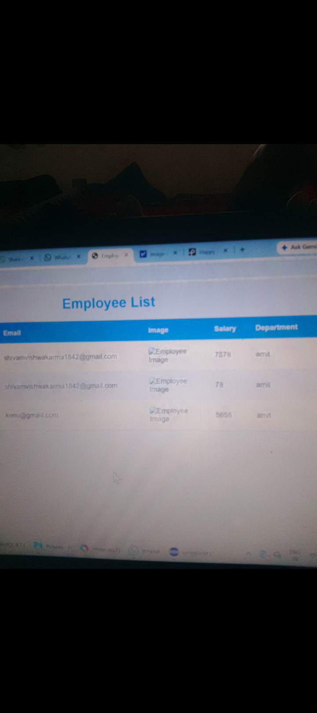

# Student Management System

A secure, full-stack web application built with Spring Boot to manage student records. 
It includes role-based authentication, full CRUD operations, and a responsive UI.

## 🔗 Live Demo
[Add your deployed link here if you deploy on Render/Railway]

## 📸 Screenshots

### Login Page


### Admin Dashboard


### Add/Edit Student Form


### Student List with Search


## ✨ Key Features

- **Authentication & Authorization**: Secure Login/Register using Spring Security + JWT
- **Role-Based Access**: 3 Roles - ADMIN, TEACHER, STUDENT
- **Full CRUD Operations**: Add, View, Update, Delete Student Records
- **Search & Filter**: Search students by Name, Roll No, Course
- **Data Validation**: Backend validation using Bean Validation API
- **Responsive UI**: Mobile-friendly design using Bootstrap 5
- **Database**: MySQL with JPA/Hibernate

## 🛠️ Tech Stack

| Category | Technology |
| --- | --- |
| **Backend** | Java 17, Spring Boot 3.2, Spring Security, Spring Data JPA |
| **Frontend** | HTML5, CSS3, Bootstrap 5, Thymeleaf, JavaScript |
| **Database** | MySQL 8.0 |
| **Tools** | Maven, Git, GitHub, Postman |
| **Server** | Apache Tomcat |

## ⚙️ How to Run Locally

1.  **Clone the repository**
    ```bash
    git clone https://github.com/shivamvishwakarma-70/student-management-system.git
    cd student-management-system
